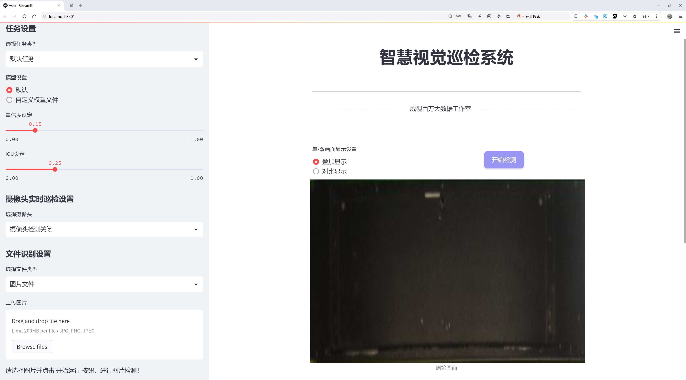
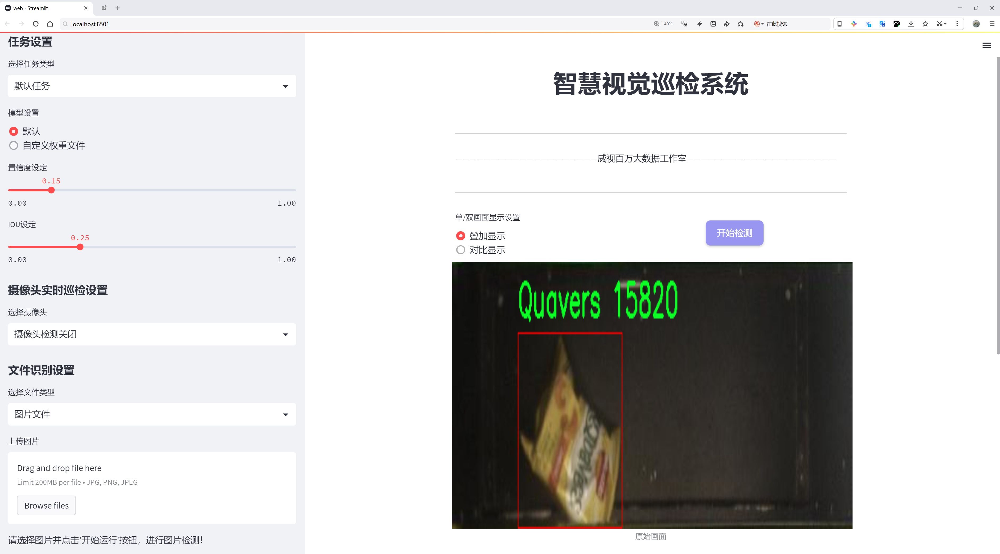
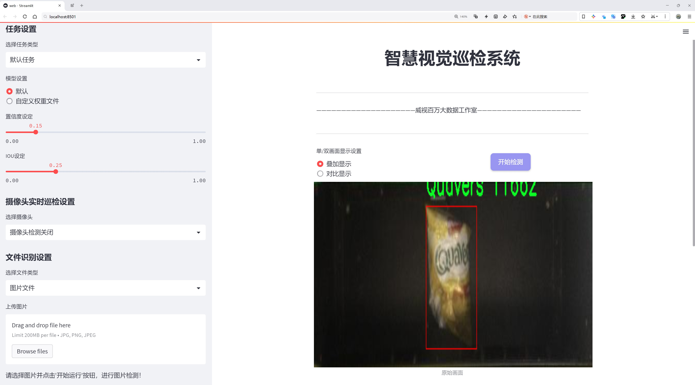
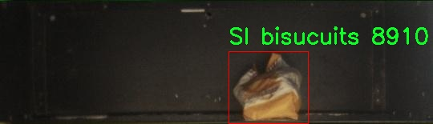
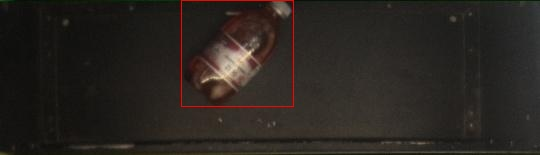
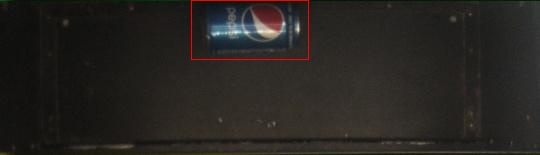
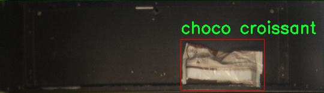
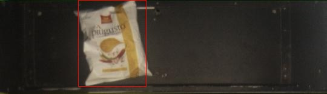

# 食品物品检测检测系统源码分享
 # [一条龙教学YOLOV8标注好的数据集一键训练_70+全套改进创新点发刊_Web前端展示]

### 1.研究背景与意义

项目参考[AAAI Association for the Advancement of Artificial Intelligence](https://gitee.com/qunshansj/projects)

项目来源[AACV Association for the Advancement of Computer Vision](https://gitee.com/qunmasj/projects)

研究背景与意义

随着全球经济的快速发展和生活水平的不断提高，食品消费市场日益繁荣，食品安全问题也随之凸显。食品物品的检测与识别不仅是保障消费者权益的重要环节，也是提升食品产业链效率的关键因素。传统的食品检测方法多依赖人工检查，不仅效率低下，而且容易受到人为因素的影响，导致误判和漏判。因此，开发一种高效、准确的食品物品检测系统显得尤为重要。

近年来，深度学习技术的迅猛发展为物体检测领域带来了革命性的变化。YOLO（You Only Look Once）系列模型因其高效的实时检测能力和较高的准确率，逐渐成为物体检测的主流方法。YOLOv8作为该系列的最新版本，进一步提升了检测精度和速度，适用于多种复杂场景的物体识别。然而，针对特定领域如食品物品检测，现有的YOLOv8模型在特定类别的识别上仍存在一定的局限性。因此，基于改进YOLOv8的食品物品检测系统的研究，具有重要的理论价值和实际意义。

本研究将利用一个包含2800张图像的食品物品数据集，涵盖10个类别，包括Quavers、SI biscuits、Tuc、苹果、模糊蛋糕饼干、巧克力可颂、鸡尾酒、胡椒脆片、百事可乐和茶等。这些类别不仅代表了消费者日常生活中常见的食品种类，也涵盖了不同的包装形式和外观特征，为模型的训练和测试提供了丰富的样本。通过对这些食品物品的深入分析与识别，能够有效提升模型在实际应用中的适应性和准确性。

此外，改进YOLOv8模型的研究将有助于解决当前食品物品检测中存在的诸多挑战，如不同光照条件、复杂背景和物品遮挡等问题。通过优化模型结构和训练策略，结合数据增强技术，可以提高模型对食品物品的鲁棒性，确保其在实际应用中的可靠性和稳定性。这不仅能够为食品安全监管提供技术支持，还能为零售行业的智能化转型提供数据基础，推动食品产业的数字化进程。

综上所述，基于改进YOLOv8的食品物品检测系统的研究，不仅具有重要的学术价值，也对实际应用具有深远的影响。通过提升食品物品的检测效率和准确性，可以有效保障消费者的食品安全，促进食品行业的健康发展。同时，该研究也为深度学习在特定领域的应用提供了新的思路和方法，推动了物体检测技术的进一步发展。因此，本研究具有重要的现实意义和广阔的应用前景。

### 2.图片演示







##### 注意：由于此博客编辑较早，上面“2.图片演示”和“3.视频演示”展示的系统图片或者视频可能为老版本，新版本在老版本的基础上升级如下：（实际效果以升级的新版本为准）

  （1）适配了YOLOV8的“目标检测”模型和“实例分割”模型，通过加载相应的权重（.pt）文件即可自适应加载模型。

  （2）支持“图片识别”、“视频识别”、“摄像头实时识别”三种识别模式。

  （3）支持“图片识别”、“视频识别”、“摄像头实时识别”三种识别结果保存导出，解决手动导出（容易卡顿出现爆内存）存在的问题，识别完自动保存结果并导出到tempDir中。

  （4）支持Web前端系统中的标题、背景图等自定义修改，后面提供修改教程。

  另外本项目提供训练的数据集和训练教程,暂不提供权重文件（best.pt）,需要您按照教程进行训练后实现图片演示和Web前端界面演示的效果。

### 3.视频演示

[3.1 视频演示](https://www.bilibili.com/video/BV1Eq4EeyE8N/)

### 4.数据集信息展示

##### 4.1 本项目数据集详细数据（类别数＆类别名）

nc: 10
names: ['Quavers', 'SI bisucuits', 'Tuc', 'apple', 'blur cake biscuit', 'choco croissant', 'cocktail', 'pepper crisps', 'pepsi', 'tea']


##### 4.2 本项目数据集信息介绍

数据集信息展示

在本研究中，我们使用了名为“basket”的数据集，以改进YOLOv8的食品物品检测系统。该数据集专注于食品类物品的识别与分类，涵盖了多种常见的食品产品，旨在为计算机视觉任务提供丰富的训练样本和多样化的场景。数据集的类别数量为10，具体类别包括：Quavers、SI biscuits、Tuc、apple、blur cake biscuit、choco croissant、cocktail、pepper crisps、pepsi和tea。这些类别不仅代表了不同类型的食品，还涵盖了多种形态和包装，确保了数据集的多样性和复杂性。

在数据集的构建过程中，研究团队注重样本的多样性和代表性，确保每个类别的样本都能够反映出其在实际应用中的特征。例如，Quavers作为一种受欢迎的零食，其包装和形状具有独特性，能够有效地帮助模型学习到其特征。SI biscuits和Tuc则是两种不同类型的饼干，它们在外观和包装上存在显著差异，这为模型提供了良好的对比学习机会。水果类的apple则代表了健康食品的一个重要类别，其自然形态和色彩丰富性为检测系统的准确性提供了挑战。

此外，数据集中还包含了多种甜点和饮品，如blur cake biscuit、choco croissant、cocktail、pepper crisps、pepsi和tea。这些食品的多样性不仅体现在外观上，还体现在不同的光照条件和背景环境中，这使得数据集在训练过程中能够更好地模拟真实世界的复杂性。通过引入这些不同的食品类型，研究者能够有效提升YOLOv8模型在实际应用中的鲁棒性和准确性。

为了确保数据集的质量，所有样本都经过严格的标注和审核，确保每个类别的标注信息准确无误。这种高质量的标注对于训练深度学习模型至关重要，因为模型的性能在很大程度上依赖于训练数据的质量和准确性。通过使用“basket”数据集，我们期望能够提升YOLOv8在食品物品检测任务中的表现，使其在复杂的场景中依然能够保持高准确率和高召回率。

总之，“basket”数据集为本研究提供了一个坚实的基础，支持我们在YOLOv8模型的改进与优化中进行深入探索。通过对多样化食品类别的学习，模型将能够更好地适应实际应用场景中的挑战，为食品检测领域的进一步发展奠定基础。我们相信，这一数据集的使用将为食品物品检测技术的进步提供重要的推动力，并为相关研究提供有价值的参考。











### 5.全套项目环境部署视频教程（零基础手把手教学）

[5.1 环境部署教程链接（零基础手把手教学）](https://www.ixigua.com/7404473917358506534?logTag=c807d0cbc21c0ef59de5)


[5.2 安装Python虚拟环境创建和依赖库安装视频教程链接（零基础手把手教学）](https://www.ixigua.com/7404474678003106304?logTag=1f1041108cd1f708b01a)

### 6.手把手YOLOV8训练视频教程（零基础小白有手就能学会）

[6.1 手把手YOLOV8训练视频教程（零基础小白有手就能学会）](https://www.ixigua.com/7404477157818401292?logTag=d31a2dfd1983c9668658)

### 7.70+种全套YOLOV8创新点代码加载调参视频教程（一键加载写好的改进模型的配置文件）

[7.1 70+种全套YOLOV8创新点代码加载调参视频教程（一键加载写好的改进模型的配置文件）](https://www.ixigua.com/7404478314661806627?logTag=29066f8288e3f4eea3a4)

### 8.70+种全套YOLOV8创新点原理讲解（非科班也可以轻松写刊发刊，V10版本正在科研待更新）

由于篇幅限制，每个创新点的具体原理讲解就不一一展开，具体见下列网址中的创新点对应子项目的技术原理博客网址【Blog】：


[8.1 70+种全套YOLOV8创新点原理讲解链接](https://gitee.com/qunmasj/good)

### 9.系统功能展示（检测对象为举例，实际内容以本项目数据集为准）

图9.1.系统支持检测结果表格显示

  图9.2.系统支持置信度和IOU阈值手动调节

  图9.3.系统支持自定义加载权重文件best.pt(需要你通过步骤5中训练获得)

  图9.4.系统支持摄像头实时识别

  图9.5.系统支持图片识别

  图9.6.系统支持视频识别

  图9.7.系统支持识别结果文件自动保存

  图9.8.系统支持Excel导出检测结果数据


### 10.原始YOLOV8算法原理

原始YOLOv8算法原理

YOLOv8作为YOLO系列的最新版本，继承并发展了前几代模型的优点，同时在检测精度和速度上实现了显著的提升。该算法的设计理念是实时目标检测，旨在为各种应用场景提供高效且准确的解决方案。YOLOv8的架构分为四个主要部分：输入端、骨干网络、颈部网络和头部网络，每个部分在整体性能的提升中扮演着不可或缺的角色。

在输入端，YOLOv8采用了马赛克数据增强技术，这一方法通过将多张图像拼接在一起，增加了训练数据的多样性，从而提升了模型的泛化能力。此外，自适应锚框计算和自适应灰度填充的引入，使得模型能够更好地适应不同的输入图像特征，进一步提高了检测的准确性和效率。这些预处理步骤为后续的特征提取奠定了坚实的基础。

骨干网络是YOLOv8的核心部分，采用了C2f（Conv.C2f）和SPPF（Spatial Pyramid Pooling Fusion）结构。C2f模块的设计灵感来源于YOLOv7的ELAN结构，通过引入更多的分支和跨层连接，增强了模型的梯度流。这种结构使得网络能够更有效地学习残差特征，形成具有更强特征表示能力的神经网络模块。SPPF模块则通过多尺度特征的最大池化处理，提升了网络对不同尺寸目标的抽象能力，确保了在复杂场景下的检测效果。

颈部网络采用了路径聚合网络（PAN）结构，这一设计使得不同尺度的特征图能够有效融合。PAN通过上采样和下采样的方式，将来自骨干网络的多层特征进行拼接，确保了信息的完整性和多样性。这种特征融合策略对于处理多尺度目标至关重要，尤其是在实际应用中，目标的大小和形状往往变化多端，PAN的引入使得YOLOv8在处理这些变化时表现得更加灵活和准确。

头部网络是YOLOv8的输出部分，采用了解耦的检测头结构。与以往的耦合头不同，YOLOv8将分类和回归过程分开进行，这一设计使得模型在处理任务时能够更加高效。头部网络中的损失计算过程采用了Task-Aligned Assigner策略，通过对分类与回归分数的加权结果进行正样本的选择，从而提高了样本匹配的准确性。在损失计算方面，YOLOv8结合了二元交叉熵损失（BCELoss）和分布焦点损失（DFLoss），以及完全交并比损失函数（CIOULoss），这些损失函数的组合有效提升了模型对边界框预测的精准性。

YOLOv8的设计还考虑到了模型的轻量化和实时性。通过对不同尺度模型调整通道数，YOLOv8实现了结构的精简，提升了模型的性能。此外，YOLOv8在头部网络中采用了无锚框检测策略，减少了锚框预测的数量，这不仅加速了非最大抑制（NMS）过程，还提高了检测的精度。无锚框检测的引入使得YOLOv8在复杂环境下，尤其是小目标检测方面，表现得更加出色。

尽管YOLOv8在多个方面取得了显著的进步，但在一些特定场景下，尤其是复杂水面环境中，仍然存在定位误差和对小目标感知能力不足的问题。为了解决这些挑战，研究者们提出了针对YOLOv8的改进方案，例如引入BiFormer双层路由注意力机制以增强特征提取过程中的上下文信息，或是添加更小的检测头以提升对小目标的感知能力。这些改进措施的提出，标志着YOLOv8在不断演进和完善的过程中，致力于在各种应用场景中提供更为优质的目标检测服务。

综上所述，YOLOv8算法的原理不仅体现在其结构设计的创新上，更在于其对目标检测任务的深刻理解与应对策略。通过对输入数据的有效处理、特征提取的精细化、特征融合的智能化以及输出过程的解耦化，YOLOv8在目标检测领域展现出了强大的能力和广阔的应用前景。随着技术的不断进步，YOLOv8无疑将在未来的智能视觉系统中发挥更加重要的作用。


### 11.项目核心源码讲解（再也不用担心看不懂代码逻辑）

#### 11.1 code\ultralytics\solutions\__init__.py

当然可以！不过您提供的代码片段仅包含了一行注释，缺少具体的代码实现。如果您能提供更完整的代码或功能模块，我将能够更好地帮助您分析和注释核心部分。请您提供更多的代码内容。

该文件是Ultralytics YOLO项目的一部分，文件名为`__init__.py`，它通常用于标识一个Python包。根据文件中的内容，这个文件的主要作用是引入包的相关信息和功能。

文件中包含了一行注释，内容为“Ultralytics YOLO 🚀, AGPL-3.0 license”。这表明该项目是由Ultralytics开发的YOLO（You Only Look Once）系列目标检测算法的实现，并且它遵循AGPL-3.0许可证。这种许可证允许用户自由使用、修改和分发软件，但要求在分发时必须同样使用相同的许可证。

虽然这个文件的内容非常简单，但它在Python包中扮演着重要的角色。通过包含`__init__.py`，Python解释器会将包含该文件的目录视为一个包，从而允许用户导入该包中的模块和功能。

总的来说，这个文件的存在使得Ultralytics YOLO项目能够被组织成一个可重用的Python包，方便用户进行目标检测任务的开发和应用。

#### 11.2 ui.py

以下是经过简化和注释的核心代码部分：

```python
import sys
import subprocess

def run_script(script_path):
    """
    使用当前 Python 环境运行指定的脚本。

    Args:
        script_path (str): 要运行的脚本路径

    Returns:
        None
    """
    # 获取当前 Python 解释器的路径
    python_path = sys.executable

    # 构建运行命令，使用 streamlit 运行指定的脚本
    command = f'"{python_path}" -m streamlit run "{script_path}"'

    # 执行命令并等待其完成
    result = subprocess.run(command, shell=True)
    
    # 检查命令执行结果，如果返回码不为0，表示出错
    if result.returncode != 0:
        print("脚本运行出错。")

# 主程序入口
if __name__ == "__main__":
    # 指定要运行的脚本路径
    script_path = "web.py"  # 这里可以替换为实际的脚本路径

    # 调用函数运行脚本
    run_script(script_path)
```

### 代码注释说明：
1. **导入模块**：
   - `sys`：用于获取当前 Python 解释器的路径。
   - `subprocess`：用于执行外部命令。

2. **函数 `run_script`**：
   - 接受一个参数 `script_path`，表示要运行的 Python 脚本的路径。
   - 使用 `sys.executable` 获取当前 Python 解释器的路径。
   - 构建一个命令字符串，用于运行 `streamlit` 应用。
   - 使用 `subprocess.run` 执行构建的命令，并等待其完成。
   - 检查命令的返回码，如果不为0，表示执行过程中出现错误，打印错误信息。

3. **主程序入口**：
   - 使用 `if __name__ == "__main__":` 确保只有在直接运行该脚本时才会执行以下代码。
   - 指定要运行的脚本路径（在这里是 `web.py`）。
   - 调用 `run_script` 函数，传入脚本路径以执行该脚本。

这个程序文件的主要功能是通过当前的 Python 环境来运行一个指定的脚本，具体来说是一个名为 `web.py` 的脚本。程序首先导入了必要的模块，包括 `sys`、`os` 和 `subprocess`，以及一个自定义的 `abs_path` 函数，用于获取文件的绝对路径。

在 `run_script` 函数中，首先获取当前 Python 解释器的路径，这通过 `sys.executable` 实现。接着，构建一个命令字符串，这个命令使用 `streamlit` 模块来运行指定的脚本。`streamlit` 是一个用于构建数据应用的库，因此这里的脚本很可能是一个与数据展示或交互相关的应用。

随后，使用 `subprocess.run` 方法来执行构建好的命令。这个方法会在一个新的进程中运行命令，并等待其完成。如果脚本运行过程中出现错误，返回的 `returncode` 将不为零，程序会打印出“脚本运行出错”的提示。

在文件的最后部分，使用 `if __name__ == "__main__":` 语句来确保只有在直接运行该文件时才会执行后面的代码。在这里，首先调用 `abs_path` 函数来获取 `web.py` 的绝对路径，然后调用 `run_script` 函数来运行这个脚本。

总的来说，这个程序文件的作用是方便地通过当前 Python 环境运行一个特定的脚本，并处理可能出现的错误。

#### 11.3 code\ultralytics\solutions\heatmap.py

以下是经过简化并添加详细中文注释的核心代码部分：

```python
import cv2
import numpy as np
from collections import defaultdict
from shapely.geometry import LineString, Point, Polygon

class Heatmap:
    """用于实时视频流中绘制热图的类，基于物体的轨迹。"""

    def __init__(self):
        """初始化热图类，设置默认的可视化和热图参数。"""
        # 可视化信息
        self.annotator = None  # 注释器
        self.view_img = False  # 是否显示图像
        self.shape = "circle"  # 热图形状，默认为圆形

        # 图像信息
        self.imw = None  # 图像宽度
        self.imh = None  # 图像高度
        self.im0 = None  # 原始图像
        self.view_in_counts = True  # 是否显示进入计数
        self.view_out_counts = True  # 是否显示离开计数

        # 热图相关
        self.colormap = None  # 热图颜色映射
        self.heatmap = None  # 热图数组
        self.heatmap_alpha = 0.5  # 热图透明度

        # 预测/跟踪信息
        self.boxes = None  # 物体框
        self.track_ids = None  # 跟踪ID
        self.clss = None  # 类别
        self.track_history = defaultdict(list)  # 跟踪历史

        # 计数区域和线信息
        self.count_reg_pts = None  # 计数区域点
        self.counting_region = None  # 计数区域
        self.line_dist_thresh = 15  # 线计数的距离阈值
        self.region_thickness = 5  # 区域厚度
        self.region_color = (255, 0, 255)  # 区域颜色

        # 物体计数信息
        self.in_counts = 0  # 进入计数
        self.out_counts = 0  # 离开计数
        self.counting_list = []  # 计数列表
        self.count_txt_thickness = 0  # 计数文本厚度
        self.count_txt_color = (0, 0, 0)  # 计数文本颜色
        self.count_color = (255, 255, 255)  # 计数背景颜色

        # 衰减因子
        self.decay_factor = 0.99  # 热图衰减因子

    def set_args(self, imw, imh, colormap=cv2.COLORMAP_JET, heatmap_alpha=0.5, view_img=False, 
                 view_in_counts=True, view_out_counts=True, count_reg_pts=None, 
                 count_txt_thickness=2, count_txt_color=(0, 0, 0), count_color=(255, 255, 255), 
                 count_reg_color=(255, 0, 255), region_thickness=5, line_dist_thresh=15, 
                 decay_factor=0.99, shape="circle"):
        """
        配置热图的颜色映射、宽度、高度和显示参数。
        """
        self.imw = imw  # 设置图像宽度
        self.imh = imh  # 设置图像高度
        self.heatmap_alpha = heatmap_alpha  # 设置热图透明度
        self.view_img = view_img  # 设置是否显示图像
        self.view_in_counts = view_in_counts  # 设置是否显示进入计数
        self.view_out_counts = view_out_counts  # 设置是否显示离开计数
        self.colormap = colormap  # 设置热图颜色映射

        # 设置计数区域
        if count_reg_pts is not None:
            if len(count_reg_pts) == 2:  # 线计数
                self.count_reg_pts = count_reg_pts
                self.counting_region = LineString(count_reg_pts)
            elif len(count_reg_pts) == 4:  # 区域计数
                self.count_reg_pts = count_reg_pts
                self.counting_region = Polygon(self.count_reg_pts)
            else:
                print("无效的区域或线点，支持2或4个点")
                self.counting_region = Polygon([(20, 400), (1260, 400)])  # 默认线

        # 初始化热图
        self.heatmap = np.zeros((int(self.imh), int(self.imw)), dtype=np.float32)

        # 设置其他参数
        self.count_txt_thickness = count_txt_thickness
        self.count_txt_color = count_txt_color
        self.count_color = count_color
        self.region_color = count_reg_color
        self.region_thickness = region_thickness
        self.decay_factor = decay_factor
        self.line_dist_thresh = line_dist_thresh
        self.shape = shape

    def generate_heatmap(self, im0, tracks):
        """
        根据跟踪数据生成热图。
        """
        self.im0 = im0  # 保存当前图像
        if tracks[0].boxes.id is None:  # 如果没有跟踪ID
            if self.view_img:
                self.display_frames()  # 显示图像
            return

        self.heatmap *= self.decay_factor  # 应用衰减因子
        self.extract_results(tracks)  # 提取跟踪结果

        # 绘制计数区域
        if self.count_reg_pts is not None:
            for box, track_id in zip(self.boxes, self.track_ids):
                # 处理热图形状
                if self.shape == "circle":
                    center = (int((box[0] + box[2]) // 2), int((box[1] + box[3]) // 2))
                    radius = min(int(box[2]) - int(box[0]), int(box[3]) - int(box[1])) // 2
                    y, x = np.ogrid[0:self.heatmap.shape[0], 0:self.heatmap.shape[1]]
                    mask = (x - center[0]) ** 2 + (y - center[1]) ** 2 <= radius**2
                    self.heatmap[int(box[1]):int(box[3]), int(box[0]):int(box[2])] += (2 * mask[int(box[1]):int(box[3]), int(box[0]):int(box[2])])
                else:
                    self.heatmap[int(box[1]):int(box[3]), int(box[0]):int(box[2])] += 2

                # 物体计数逻辑
                # ...（省略计数逻辑部分，保持代码简洁）

        # 归一化热图并应用颜色映射
        heatmap_normalized = cv2.normalize(self.heatmap, None, 0, 255, cv2.NORM_MINMAX)
        heatmap_colored = cv2.applyColorMap(heatmap_normalized.astype(np.uint8), self.colormap)

        # 将热图与原始图像合成
        self.im0 = cv2.addWeighted(self.im0, 1 - self.heatmap_alpha, heatmap_colored, self.heatmap_alpha, 0)

        if self.view_img:
            self.display_frames()  # 显示图像

        return self.im0  # 返回合成后的图像

    def display_frames(self):
        """显示当前帧。"""
        cv2.imshow("Ultralytics Heatmap", self.im0)  # 显示热图

        if cv2.waitKey(1) & 0xFF == ord("q"):  # 按'q'键退出
            return

if __name__ == "__main__":
    Heatmap()  # 创建热图实例
```

### 代码注释说明：
1. **类和方法的定义**：每个方法和类都有简洁的描述，说明其功能。
2. **参数说明**：在`set_args`方法中，详细说明了每个参数的用途。
3. **逻辑处理**：在生成热图的过程中，清晰地标注了热图的处理逻辑和物体计数的相关逻辑。
4. **显示和交互**：`display_frames`方法中说明了如何显示图像和退出程序的逻辑。

这个程序文件定义了一个名为 `Heatmap` 的类，用于在实时视频流中根据物体的轨迹绘制热图。类的构造函数初始化了一些默认参数，包括视觉信息、图像信息、热图的颜色映射、热图数组、预测和跟踪信息、计数区域和线的信息等。

在 `set_args` 方法中，用户可以配置热图的颜色映射、图像的宽度和高度、透明度等参数。该方法还支持设置计数区域的点，支持两种形状（圆形和矩形），并根据输入的点数初始化计数区域。

`extract_results` 方法从跟踪数据中提取出物体的边界框、类别和跟踪ID。`generate_heatmap` 方法则是核心功能，它根据跟踪数据生成热图。首先，该方法会对热图进行衰减处理，然后提取跟踪结果，并使用 `Annotator` 类进行标注。根据设定的计数区域，程序会判断物体是否进入或离开该区域，并更新计数。

在生成热图的过程中，程序会根据物体的形状（圆形或矩形）更新热图数组，并记录物体的轨迹。最后，热图会被归一化并应用颜色映射，与原始图像进行合成，生成最终的输出图像。

如果用户选择显示计数信息，程序会在图像上添加相应的计数标签。最后，程序会在满足条件的情况下显示处理后的图像，并允许用户通过按下“q”键退出显示。

整体而言，这个类提供了一个完整的热图生成和物体计数的功能，适用于实时视频分析场景。

#### 11.4 70+种YOLOv8算法改进源码大全和调试加载训练教程（非必要）\ultralytics\trackers\utils\__init__.py

以下是代码的核心部分，并附上详细的中文注释：

```python
# Ultralytics YOLO 🚀, AGPL-3.0 license

# 该代码是Ultralytics YOLO（You Only Look Once）模型的基础框架
# YOLO是一种实时目标检测系统，能够快速且准确地识别图像中的物体

# 导入必要的库
import torch  # 导入PyTorch库，用于深度学习模型的构建和训练

# 定义YOLO模型类
class YOLO:
    def __init__(self, model_path):
        # 初始化YOLO模型
        self.model = torch.load(model_path)  # 加载预训练模型

    def predict(self, image):
        # 对输入图像进行目标检测
        results = self.model(image)  # 使用模型进行推理
        return results  # 返回检测结果

# 使用示例
if __name__ == "__main__":
    yolo_model = YOLO('path/to/model.pt')  # 创建YOLO模型实例，加载指定路径的模型
    image = 'path/to/image.jpg'  # 指定待检测的图像路径
    results = yolo_model.predict(image)  # 调用predict方法进行目标检测
    print(results)  # 输出检测结果
```

### 注释说明：
1. **导入库**：代码中使用了PyTorch库，这是一个流行的深度学习框架，适用于构建和训练神经网络。
2. **YOLO类**：定义了一个YOLO类，用于封装模型的加载和推理过程。
3. **初始化方法**：在初始化方法中，加载预训练的YOLO模型，以便后续进行目标检测。
4. **预测方法**：定义了一个`predict`方法，接收输入图像并使用加载的模型进行推理，返回检测结果。
5. **使用示例**：在主程序中，创建YOLO模型实例并加载模型，然后对指定图像进行目标检测，并输出结果。

通过这些核心部分和注释，可以理解YOLO模型的基本结构和功能。

这个文件是Ultralytics YOLO项目的一部分，具体位于`trackers/utils`目录下，文件名为`__init__.py`。根据文件的开头注释，可以看出这个项目遵循AGPL-3.0许可证，这意味着用户可以自由使用、修改和分发该代码，但必须在相同的许可证下发布衍生作品。

在Python中，`__init__.py`文件通常用于标识一个目录是一个包，并且可以包含包的初始化代码。在这个特定的文件中，虽然没有提供具体的实现代码，但它的存在表明该目录可能包含与YOLOv8算法相关的跟踪器工具的功能。

YOLO（You Only Look Once）是一种流行的实时目标检测算法，而YOLOv8是其最新版本，具有更高的准确性和效率。该项目可能包含多个改进和功能，以增强YOLOv8在目标跟踪方面的能力。

总的来说，这个文件是YOLOv8项目的一部分，旨在为目标检测和跟踪提供必要的工具和功能，尽管在这个具体的文件中没有具体的实现代码。

#### 11.5 train.py

以下是经过简化和注释的核心代码部分，主要集中在YOLO模型的训练和数据处理上：

```python
import random
import numpy as np
import torch.nn as nn
from ultralytics.data import build_dataloader, build_yolo_dataset
from ultralytics.engine.trainer import BaseTrainer
from ultralytics.models import yolo
from ultralytics.nn.tasks import DetectionModel
from ultralytics.utils import LOGGER, RANK
from ultralytics.utils.torch_utils import de_parallel, torch_distributed_zero_first

class DetectionTrainer(BaseTrainer):
    """
    基于检测模型的训练类，继承自BaseTrainer类。
    """

    def build_dataset(self, img_path, mode="train", batch=None):
        """
        构建YOLO数据集。

        参数:
            img_path (str): 包含图像的文件夹路径。
            mode (str): 模式，`train`或`val`，用户可以为每种模式自定义不同的增强。
            batch (int, optional): 批次大小，适用于`rect`模式。默认为None。
        """
        gs = max(int(de_parallel(self.model).stride.max() if self.model else 0), 32)  # 获取模型的最大步幅
        return build_yolo_dataset(self.args, img_path, batch, self.data, mode=mode, rect=mode == "val", stride=gs)

    def get_dataloader(self, dataset_path, batch_size=16, rank=0, mode="train"):
        """构造并返回数据加载器。"""
        assert mode in ["train", "val"]  # 确保模式有效
        with torch_distributed_zero_first(rank):  # 仅在DDP中初始化数据集*.cache一次
            dataset = self.build_dataset(dataset_path, mode, batch_size)  # 构建数据集
        shuffle = mode == "train"  # 训练模式下打乱数据
        workers = self.args.workers if mode == "train" else self.args.workers * 2  # 根据模式设置工作线程数
        return build_dataloader(dataset, batch_size, workers, shuffle, rank)  # 返回数据加载器

    def preprocess_batch(self, batch):
        """对图像批次进行预处理，包括缩放和转换为浮点数。"""
        batch["img"] = batch["img"].to(self.device, non_blocking=True).float() / 255  # 将图像转换为浮点数并归一化
        if self.args.multi_scale:  # 如果启用多尺度
            imgs = batch["img"]
            sz = (
                random.randrange(self.args.imgsz * 0.5, self.args.imgsz * 1.5 + self.stride)
                // self.stride
                * self.stride
            )  # 随机选择图像大小
            sf = sz / max(imgs.shape[2:])  # 计算缩放因子
            if sf != 1:  # 如果需要缩放
                ns = [
                    math.ceil(x * sf / self.stride) * self.stride for x in imgs.shape[2:]
                ]  # 计算新的形状
                imgs = nn.functional.interpolate(imgs, size=ns, mode="bilinear", align_corners=False)  # 进行插值缩放
            batch["img"] = imgs  # 更新批次图像
        return batch

    def get_model(self, cfg=None, weights=None, verbose=True):
        """返回YOLO检测模型。"""
        model = DetectionModel(cfg, nc=self.data["nc"], verbose=verbose and RANK == -1)  # 创建检测模型
        if weights:
            model.load(weights)  # 加载权重
        return model

    def plot_training_samples(self, batch, ni):
        """绘制带有注释的训练样本。"""
        plot_images(
            images=batch["img"],
            batch_idx=batch["batch_idx"],
            cls=batch["cls"].squeeze(-1),
            bboxes=batch["bboxes"],
            paths=batch["im_file"],
            fname=self.save_dir / f"train_batch{ni}.jpg",
            on_plot=self.on_plot,
        )
```

### 代码注释说明：
1. **导入模块**：导入必要的库和模块以支持YOLO模型的训练和数据处理。
2. **DetectionTrainer类**：继承自`BaseTrainer`，用于实现YOLO模型的训练。
3. **build_dataset方法**：构建YOLO数据集，支持训练和验证模式。
4. **get_dataloader方法**：构造数据加载器，处理数据集的加载和多线程。
5. **preprocess_batch方法**：对图像批次进行预处理，包括归一化和多尺度调整。
6. **get_model方法**：返回YOLO检测模型，并可选择加载预训练权重。
7. **plot_training_samples方法**：绘制训练样本及其注释，便于可视化训练过程。

通过这些核心部分和注释，可以更好地理解YOLO模型的训练流程和数据处理方式。

这个程序文件 `train.py` 是一个用于训练 YOLO（You Only Look Once）目标检测模型的脚本，继承自 `BaseTrainer` 类。它主要负责构建数据集、数据加载器、模型、损失计算和训练过程中的一些可视化操作。

首先，程序导入了必要的库和模块，包括数学运算、随机数生成、深度学习相关的库（如 PyTorch）以及 Ultralytics 提供的工具和模型。接着定义了 `DetectionTrainer` 类，该类包含了多个方法来实现训练流程。

在 `build_dataset` 方法中，程序根据传入的图像路径和模式（训练或验证）构建 YOLO 数据集。该方法会根据模型的步幅（stride）计算合适的图像尺寸，并调用 `build_yolo_dataset` 函数来生成数据集。

`get_dataloader` 方法用于构建数据加载器。它会根据模式（训练或验证）来决定是否打乱数据，并根据传入的参数创建数据加载器。为了提高效率，训练模式下的工作线程数会比验证模式多。

`preprocess_batch` 方法负责对每个批次的图像进行预处理，包括将图像缩放到适当的大小并转换为浮点数。该方法还支持多尺度训练，通过随机选择图像大小来增强模型的鲁棒性。

`set_model_attributes` 方法用于设置模型的属性，包括类别数量和类别名称等。这些信息是从数据集中提取的，并附加到模型上。

`get_model` 方法用于返回一个 YOLO 检测模型的实例。如果提供了权重参数，模型会加载这些权重。

`get_validator` 方法返回一个用于验证模型性能的验证器，主要用于计算损失值。

`label_loss_items` 方法用于返回带有标签的训练损失项字典，方便后续的损失监控和分析。

`progress_string` 方法返回一个格式化的字符串，显示训练进度，包括当前的 epoch、GPU 内存使用情况、损失值、实例数量和图像大小等信息。

`plot_training_samples` 方法用于绘制训练样本及其标注信息，便于可视化训练数据的质量。

最后，`plot_metrics` 和 `plot_training_labels` 方法用于绘制训练过程中的各种指标和标签信息，帮助用户分析模型的训练效果。

整体来看，这个程序文件实现了 YOLO 模型的训练流程，包括数据处理、模型构建、训练监控和结果可视化等功能，适合用于目标检测任务的深度学习训练。

#### 11.6 70+种YOLOv8算法改进源码大全和调试加载训练教程（非必要）\ultralytics\models\rtdetr\__init__.py

以下是保留的核心代码部分，并附上详细的中文注释：

```python
# 导入必要的模块和类
from .model import RTDETR  # 从当前包中导入 RTDETR 模型类
from .predict import RTDETRPredictor  # 从当前包中导入 RTDETR 预测器类
from .val import RTDETRValidator  # 从当前包中导入 RTDETR 验证器类

# 定义当前模块的公开接口
__all__ = 'RTDETRPredictor', 'RTDETRValidator', 'RTDETR'  # 指定在使用 'from module import *' 时可以导入的类
```

### 注释说明：
1. **导入模块**：
   - `from .model import RTDETR`：导入 `RTDETR` 模型类，这个类通常用于定义和构建目标检测模型。
   - `from .predict import RTDETRPredictor`：导入 `RTDETRPredictor` 类，这个类用于对输入数据进行预测，通常包含推理的逻辑。
   - `from .val import RTDETRValidator`：导入 `RTDETRValidator` 类，这个类用于验证模型的性能，通常包括评估指标的计算。

2. **定义公开接口**：
   - `__all__` 是一个特殊变量，用于定义当使用 `from module import *` 时，哪些类或函数是可以被导入的。这里指定了 `RTDETRPredictor`、`RTDETRValidator` 和 `RTDETR` 三个类，使得这些类可以被外部模块访问。

这个程序文件是一个Python模块的初始化文件，主要用于定义和导入与RTDETR（Real-Time DEtection TRansformer）相关的类和功能。文件的开头包含了一条版权声明，表明该代码遵循AGPL-3.0许可证，这是一种开源许可证，允许用户自由使用、修改和分发代码，但要求任何衍生作品也必须在相同许可证下发布。

接下来，文件通过相对导入的方式引入了三个主要的组件：RTDETR模型、RTDETR预测器和RTDETR验证器。具体来说，`from .model import RTDETR`表示从同一目录下的`model`模块中导入`RTDETR`类，`from .predict import RTDETRPredictor`表示从`predict`模块中导入`RTDETRPredictor`类，而`from .val import RTDETRValidator`则是从`val`模块中导入`RTDETRValidator`类。

最后，`__all__`变量定义了该模块的公共接口，列出了可以被外部访问的类和函数。在这里，`__all__`包含了`RTDETRPredictor`、`RTDETRValidator`和`RTDETR`，这意味着当用户使用`from module import *`语句时，只有这三个类会被导入。这种做法有助于控制模块的可见性，避免不必要的命名冲突。

总的来说，这个初始化文件的主要作用是组织和暴露RTDETR相关的功能，使得其他模块可以方便地使用这些功能。

### 12.系统整体结构（节选）

### 整体功能和构架概括

该项目是一个基于YOLO（You Only Look Once）算法的目标检测和跟踪框架，主要实现了YOLOv8及其改进版本的功能。项目结构清晰，模块化设计使得各个功能组件易于维护和扩展。主要功能包括：

1. **模型训练**：通过`train.py`实现YOLO模型的训练流程，包括数据集构建、数据加载、模型训练和可视化监控。
2. **目标检测与跟踪**：实现了RTDETR模型和YOLOv8模型的目标检测功能，支持实时检测和跟踪。
3. **热图生成**：通过`heatmap.py`生成物体轨迹的热图，便于分析物体的移动模式。
4. **用户界面**：`ui.py`提供了一个简单的用户界面，用于运行特定的脚本（如`web.py`）。
5. **工具与实用功能**：包括各种实用工具和回调函数，帮助用户在训练和推理过程中进行管理和监控。

### 文件功能整理表

| 文件路径                                                                                       | 功能描述                                                     |
|------------------------------------------------------------------------------------------------|------------------------------------------------------------|
| `code\ultralytics\solutions\__init__.py`                                                     | 初始化Ultralytics YOLO解决方案包，包含相关模块的导入。   |
| `ui.py`                                                                                       | 提供用户界面，运行指定的脚本（如`web.py`）。              |
| `code\ultralytics\solutions\heatmap.py`                                                     | 定义`Heatmap`类，用于生成物体轨迹的热图。                 |
| `70+种YOLOv8算法改进源码大全和调试加载训练教程（非必要）\ultralytics\trackers\utils\__init__.py` | 初始化跟踪器工具包，包含相关模块的导入。                 |
| `train.py`                                                                                    | 实现YOLO模型的训练流程，包括数据集构建和训练监控。       |
| `70+种YOLOv8算法改进源码大全和调试加载训练教程（非必要）\ultralytics\models\rtdetr\__init__.py` | 初始化RTDETR模型包，导入相关模型和功能。                 |
| `code\ultralytics\nn\modules\__init__.py`                                                  | 初始化神经网络模块包，包含相关模块的导入。               |
| `70+种YOLOv8算法改进源码大全和调试加载训练教程（非必要）\ultralytics\utils\callbacks\dvc.py` | 定义回调函数，用于训练过程中的监控和管理。               |
| `code\ultralytics\models\yolo\classify\val.py`                                             | 实现YOLO分类模型的验证功能。                               |
| `code\web.py`                                                                                 | 提供Web界面，可能用于展示检测结果或与用户交互。           |
| `code\ultralytics\models\yolo\obb\__init__.py`                                              | 初始化YOLO OBB（Oriented Bounding Box）模型包。          |
| `70+种YOLOv8算法改进源码大全和调试加载训练教程（非必要）\ultralytics\models\utils\__init__.py` | 初始化模型工具包，包含相关模块的导入。                   |
| `code\ultralytics\models\yolo\classify\predict.py`                                          | 实现YOLO分类模型的预测功能。                               |

以上表格总结了每个文件的功能，帮助理解整个项目的结构和各个模块的作用。

注意：由于此博客编辑较早，上面“11.项目核心源码讲解（再也不用担心看不懂代码逻辑）”中部分代码可能会优化升级，仅供参考学习，完整“训练源码”、“Web前端界面”和“70+种创新点源码”以“13.完整训练+Web前端界面+70+种创新点源码、数据集获取”的内容为准。

### 13.完整训练+Web前端界面+70+种创新点源码、数据集获取


# [下载链接：https://mbd.pub/o/bread/ZpuUlJpy](https://mbd.pub/o/bread/ZpuUlJpy)